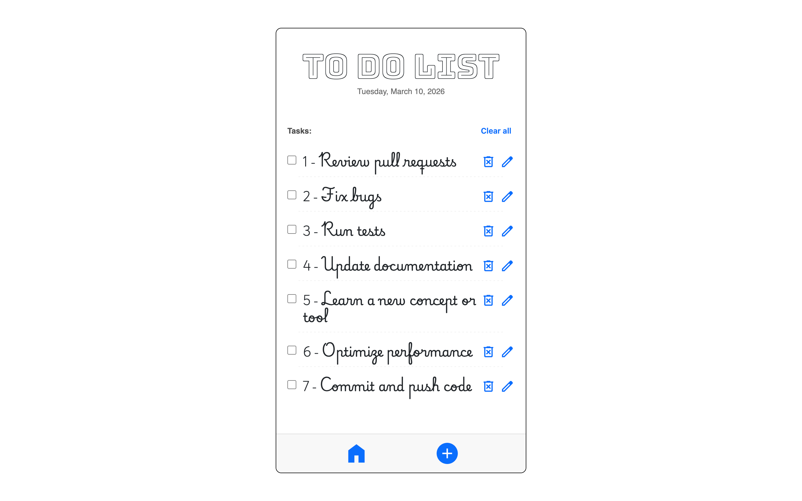
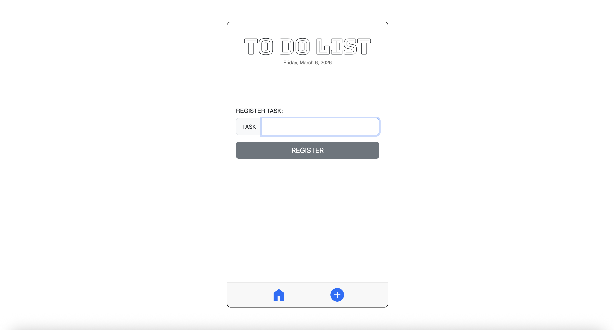
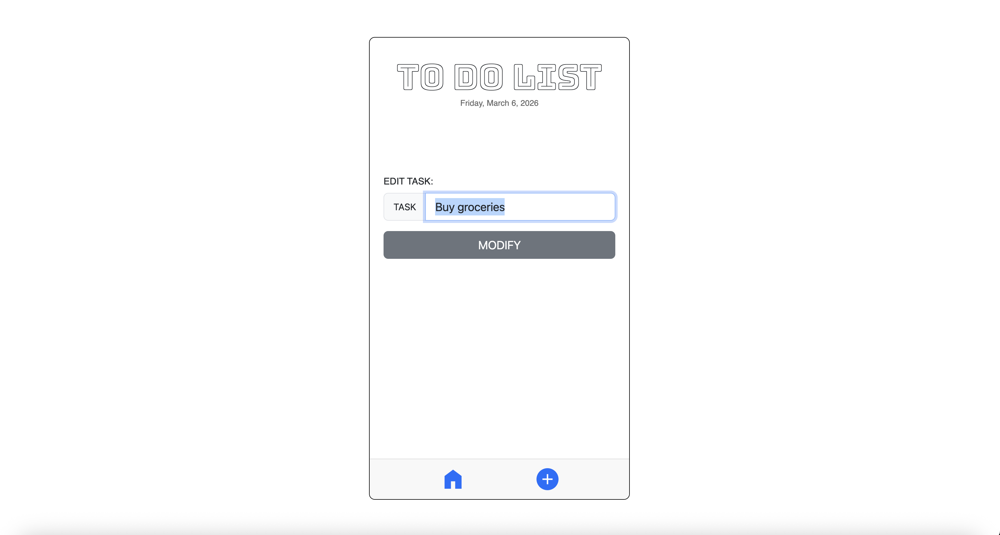

# TO-DO APP

## Description

This To-Do application started as a simple study project and gradually evolved into a more complete and polished app.

The project initially stored user input in React state and displayed tasks using a mapped list. Over time, additional features were implemented, including editing and deleting tasks, input validation to prevent empty entries, and confirmation dialogs for user actions.

The user interface was improved using Bootstrap, Google Fonts, and custom CSS to create a clean and modern design. Tasks can also be marked as completed using checkboxes, which apply a visual "line-through" effect to indicate finished items.

To improve user experience, LocalStorage was implemented through React Context to persist tasks across pages (Home, Register, and Edit) and maintain the list even after refreshing the browser. The application also displays the current date using JavaScript date formatting to enhance daily task management.

[Live Demo Link](https://to-do-app-sable-three.vercel.app/)

---

## Features

- Add, edit, and delete tasks
- Mark tasks as completed
- Input validation and confirmation dialogs
- Persistent data with LocalStorage
- Shared state management with React Context
- Clean UI with Bootstrap and Google Fonts
- Dynamic current date display
- Scrollable task list to maintain layout with many tasks
- Sticky footer layout for better mobile experience

---

## Tech Stack

- React
- React Context API
- React Router
- JavaScript (ES6+)
- Bootstrap
- CSS
- Google Fonts
- LocalStorage

---

## Screenshots





## Live Demo

[Live Demo Link](https://to-do-app-sable-three.vercel.app/)

## Getting Started

Clone the repository and run locally:

```bash
# 1) Clone the repo
git clone https://github.com/fabioesilveira/TO-DO_APP.git

# 2) Navigate to project folder
cd TO-DO_APP

# 3) Install dependencies
npm install

# 4) Start the development server
npm run dev
